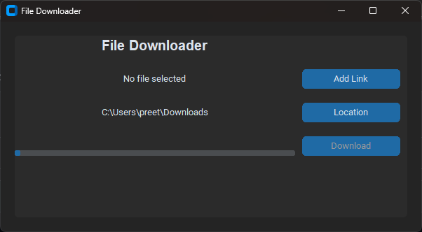

# Downloader

**Downloader** is an application that lets you download files from URL.
You can copy-paste URL of any file and download it directly to a location of your choice.

## Terms of use

By using this project or its source code, for any purpose and in any shape or form, you grant your **implicit agreement
** to all the following statements:

- You **promise to never blame this app for slow Wi-Fi or questionable download choices.**
- You **agree that naps are a human right and should be embraced at least once a day**
- You **understand that while this app may be magical, it can't fix broken hearts or expired coupons.**
- You **believe that watching one more episode of anime is always the right decision, even at 3 a.m.**
- You **understand that saving your game before doing anything risky is a universal law of survival.**

To join me and my friends for a gaming session, [click here](https://discord.gg/yKtHj6D8Df).

## Download

- 🟢 **[Stable release](https://github.com/Preetthee/downloader/releases/latest)**

> **Note**:
> If you're unsure which build is right for your system, consult with [this page](https://useragent.cc) to determine
> your OS and CPU architecture.

## Features

- Download files by URL

## Screenshots

